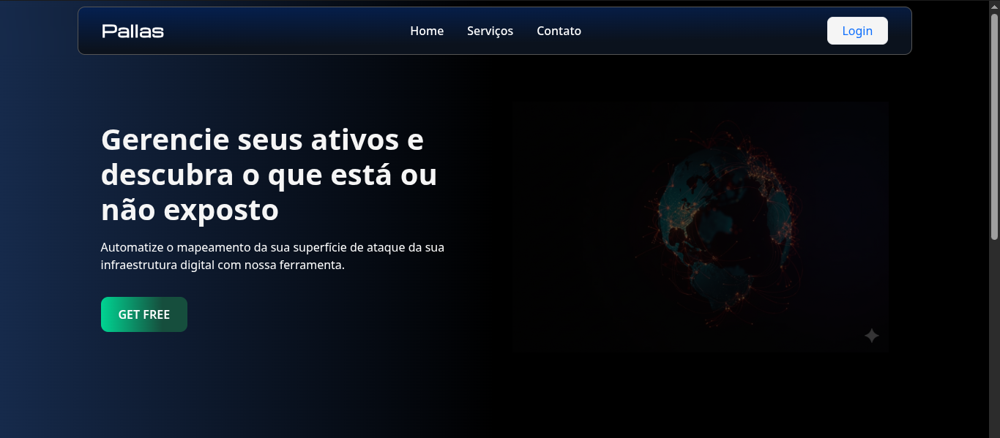
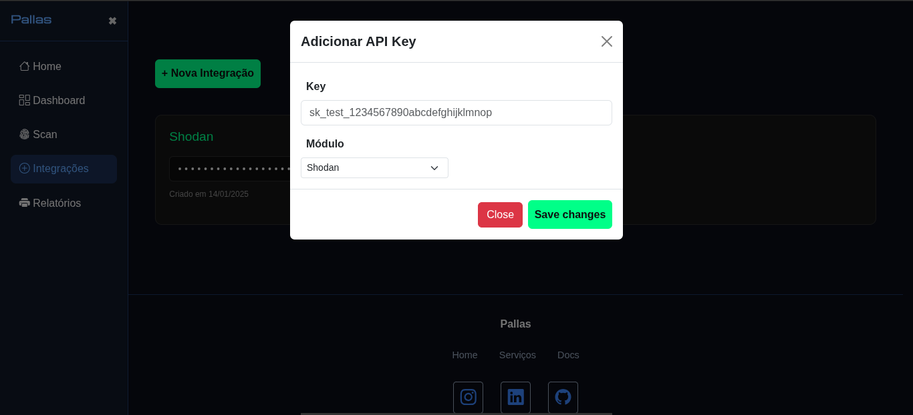
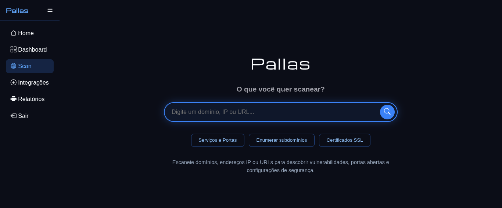
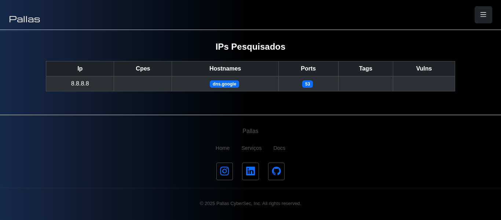

<h1 align="center"> Pallas CyberSec | Final Paper Project (TCC)</h1>

Web application composed of offensive security modules focused on Information Gathering and attack surface mapping of digital assets.

---

---

## 📖 Overview

**Pallas CyberSec** allows integration with Shodan through its REST API.

* Domain and IP searches (in development)
* Organization details, public IPs, services and ports, DNS record information (in development)
* Dashboard metrics visualization (in development)

---

## Preview

- [Home](https://Julio-Caio.github.io/Pallas-Cybersec/public/index.html)

 

 

## Technologies Used:

## Authors

<a href="https://github.com/Julio-Caio"><b>Júlio Caio</b></a>

 

---